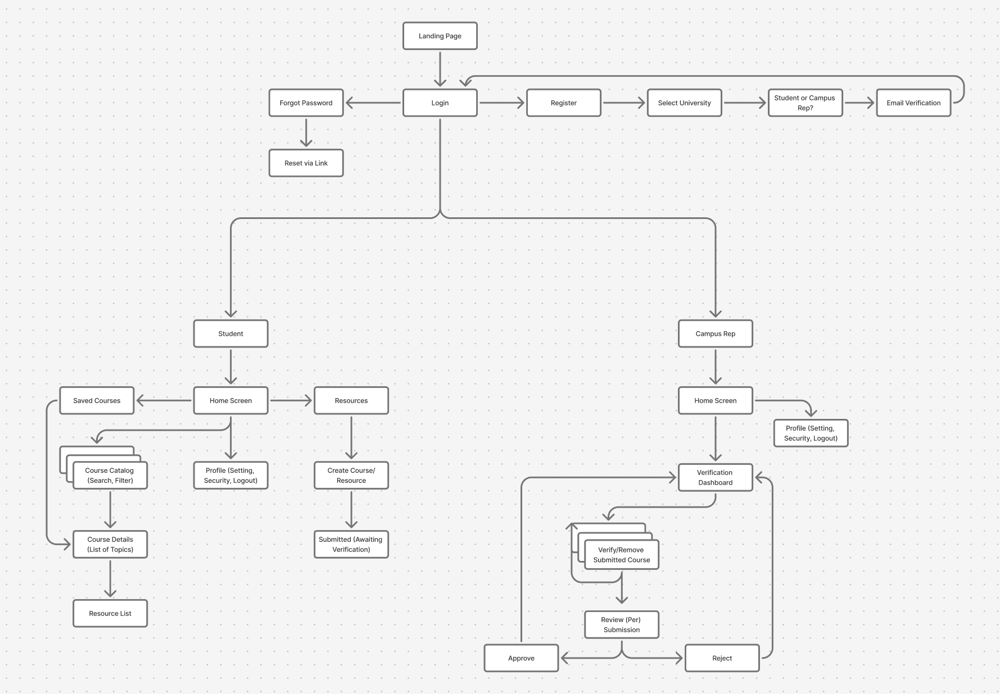
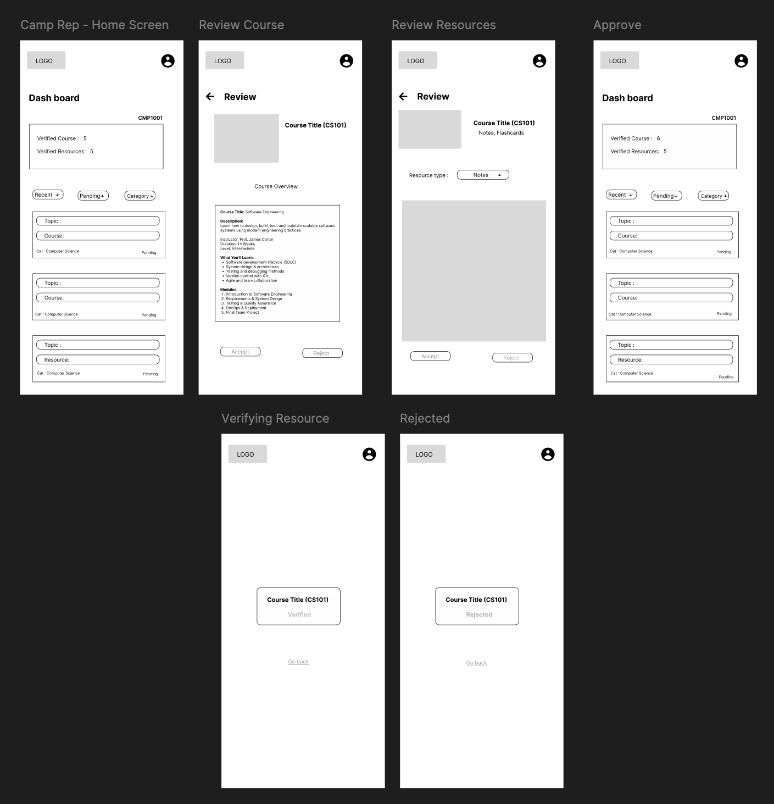
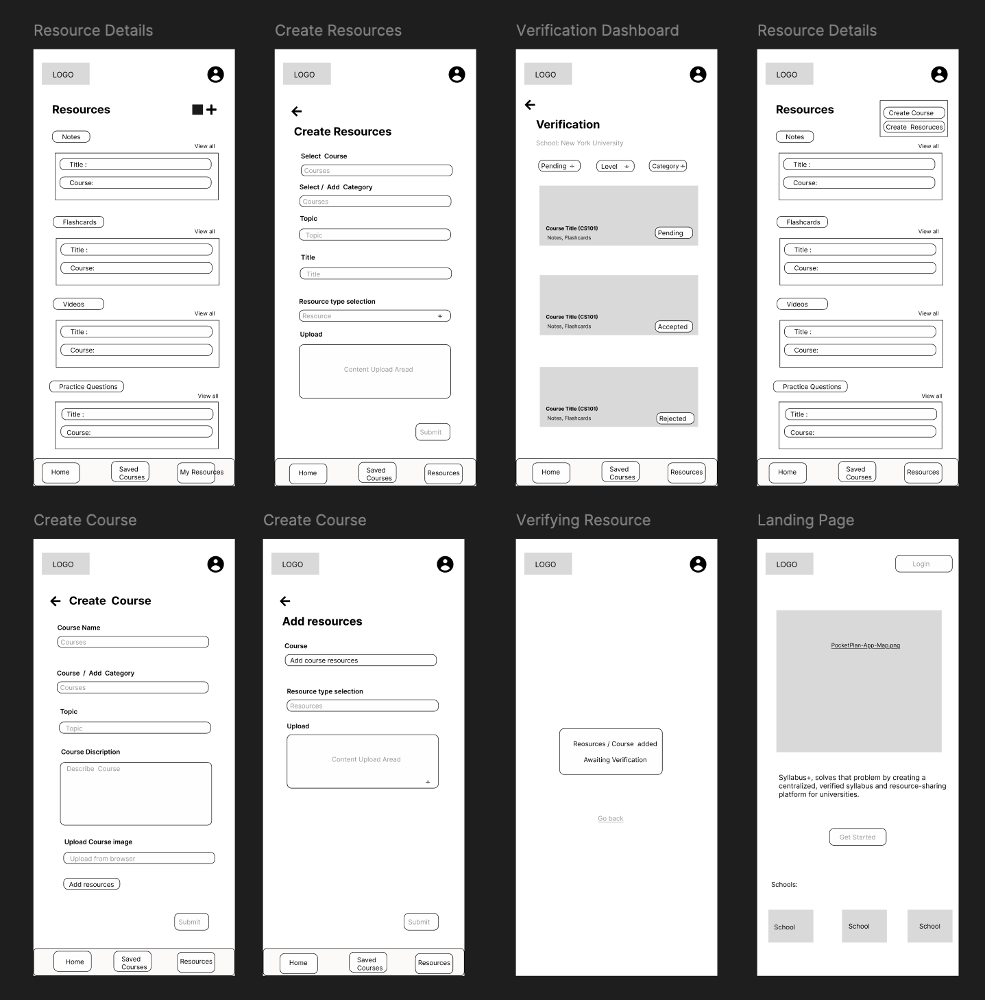
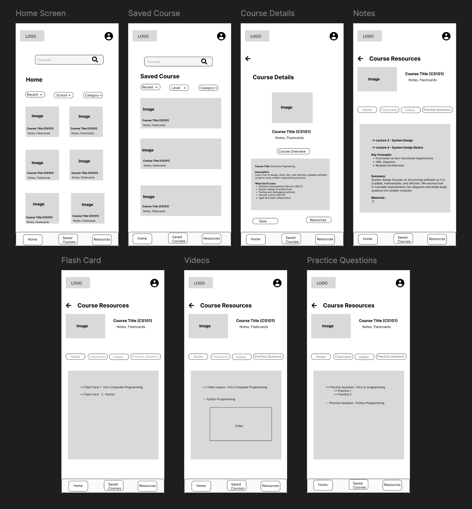
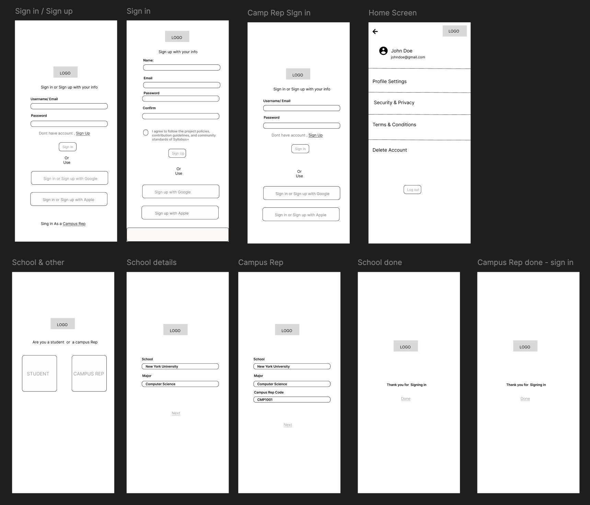

# UX Design Deliverables

This document contains the elements of UX. It follows the requirements in the following instructions:
- [instructions-0a-app-map-wireframes.md](instructions-0a-app-map-wireframes.md)
- [instructions-0b-prototyping.md](instructions-0b-prototyping.md)

## Prototype
- Figma prototype (mobile): [instructions-0b-prototyping.md](https://www.figma.com/proto/7yWqCcVscmOe9qnbFZPaC3/Student-Expense-Tracker-App---Wireframe?node-id=47-129&p=f&t=GGNZIUIjtlwsmozZ-0&scaling=scale-down&content-scaling=fixed&page-id=0%3A1&starting-point-node-id=47%3A129)
- Every navigation/action should be clickable, including overlays; update the link above after publishing

## App Map

## Wireframes (mobile-first)
All frames use gray placeholders, consistent widths, and bottom navigation where needed. Titles correspond to the screens in each image.

### Campus rep verification

- Dashboard with pending/approved course counts and filters
- Review course details where you can either accept or reject
- Review resources where you can accept or reject.
- Approval view and verify or rejected states for submissions

### Student resources and course content

- Home with search/filters and course cards
- Saved courses
- Course detail with tabs for notes, flashcards, videos, practice questions
- Individual tabs showing notes, flashcards, videos, and practice content

### Home, saved courses, and navigation

- Landing page with filters and course cards
- Saved courses layout
- Course details with resources actions and a navigation bar at the bottom
- Resource tabs (notes, flashcards, videos, practice questions) with content blocks

### Authentication and onboarding

- Sign in and Sign up choices where the user needs to complete the email and password form.
- Campus rep sign-in variant form as well
- Profile and settings screen after login
- Student or campus rep selection
- School details
- Campus rep details
- Confirmation screens

